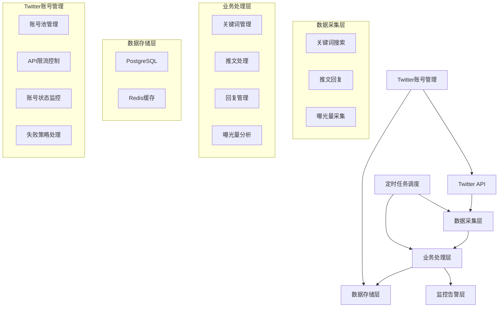
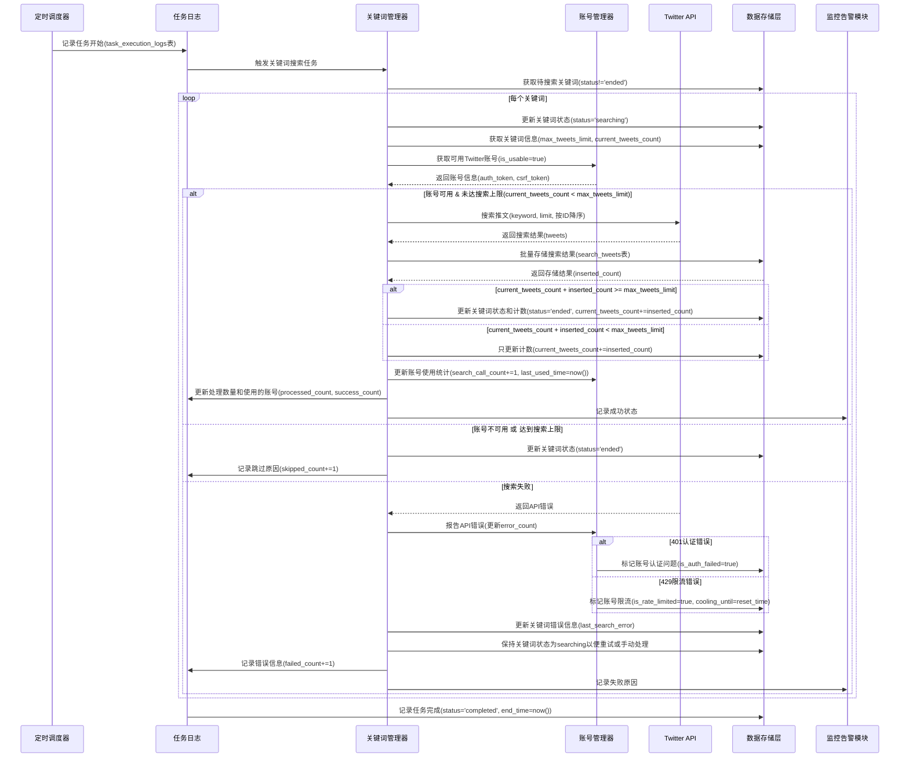
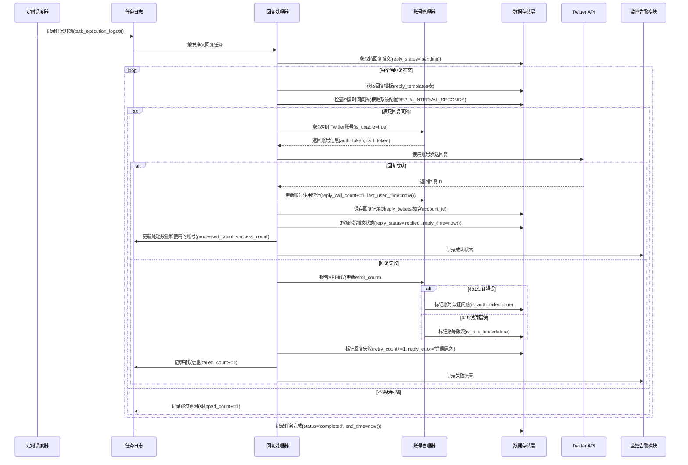
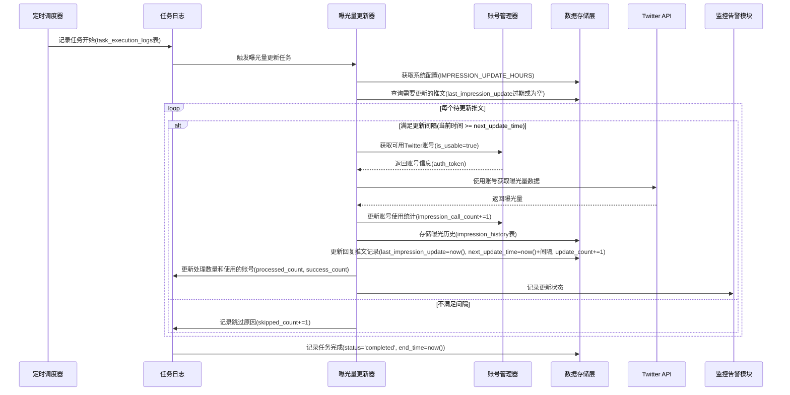
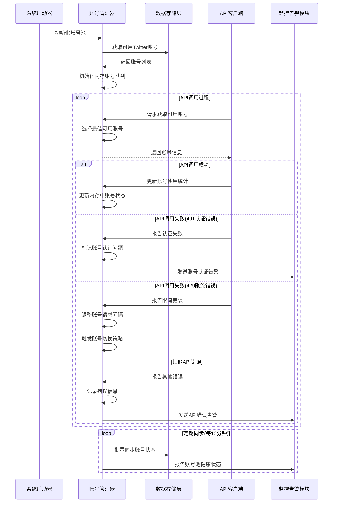
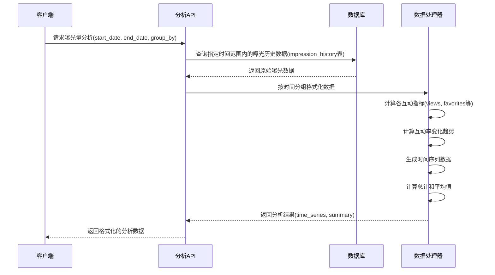

# Twitter自动回复系统技术设计文档

## 一、系统架构

### 1. 整体架构



### 2. 系统模块

#### 2.1 定时调度模块
- 负责系统各项任务的定时触发
- 管理任务执行频率和调度策略
- 支持任务优先级管理
- 提供任务执行状态监控

#### 2.2 任务日志模块
- 记录任务执行的完整生命周期
- 追踪任务处理数量和成功/失败统计
- 记录任务执行过程中的错误信息
- 提供任务执行历史查询功能

#### 2.3 关键词管理模块
- 管理搜索关键词的生命周期
- 执行关键词搜索任务
- 更新关键词搜索状态
- 维护关键词优先级和分类

#### 2.4 推文处理模块
- 存储和管理搜索到的推文
- 处理推文的元数据和内容
- 追踪推文的状态变化
- 管理推文的回复状态

#### 2.5 回复管理模块
- 管理回复模板
- 执行推文回复任务
- 检查回复时间间隔
- 追踪回复状态和效果

#### 2.6 曝光量分析模块
- 执行曝光量更新任务
- 记录互动指标变化
- 计算互动效果
- 生成曝光量分析报告

#### 2.7 数据存储模块
- 管理数据库连接和事务
- 提供数据访问接口
- 实现数据缓存策略
- 确保数据一致性

#### 2.8 监控告警模块
- 监控系统运行状态
- 追踪任务执行情况
- 检测异常情况
- 发送告警通知

#### 2.9 Twitter账号管理模块
- 管理多个Twitter账号的认证信息和状态
- 监控API调用限制和错误状态
- 实现账号轮换和自动切换策略
- 提供API调用统计和账号健康度分析
- 维护账号内存队列并定期同步到数据库

## 二、技术选型

### 1. 后端技术栈

- 开发语言：Python 3.9+
- Web框架：FastAPI
- 数据库：
  - 主数据库：PostgreSQL（业务数据）
  - 缓存：Redis
- 任务调度：Celery
- API文档：Swagger/OpenAPI

### 2. 前端技术栈

- 框架：Vue 3
- UI组件库：Element Plus
- 图表库：ECharts
- 构建工具：Vite

### 3. 部署环境

- 容器化：Docker
- 监控：Prometheus + Grafana
- 日志：ELK Stack

## 三、详细设计

### 1. 数据库设计

#### 1.1 关键词管理表 (keywords)

```sql
CREATE TABLE keywords (
    id SERIAL PRIMARY KEY,
    keyword VARCHAR(255) NOT NULL,           -- 关键词
    category VARCHAR(50) NOT NULL,           -- 关键词分类
    priority INTEGER DEFAULT 0,              -- 优先级
    is_active BOOLEAN DEFAULT true,          -- 是否启用
    status VARCHAR(20) DEFAULT 'pending',    -- 状态：pending(待搜索), searching(搜索中), ended(结束搜索)
    last_search_time TIMESTAMP,             -- 最后搜索时间
    search_count INTEGER DEFAULT 0,          -- 搜索次数
    max_tweets_limit INTEGER DEFAULT 100,    -- 最多搜索的推文数量限制
    current_tweets_count INTEGER DEFAULT 0,  -- 目前已搜索到的推文数量
    last_search_error TEXT,                 -- 最后一次搜索失败原因
    created_at TIMESTAMP DEFAULT CURRENT_TIMESTAMP,
    updated_at TIMESTAMP DEFAULT CURRENT_TIMESTAMP,
    
    CONSTRAINT idx_keywords_unique UNIQUE (keyword, category)
);

CREATE INDEX idx_keywords_status ON keywords(status, last_search_time);
CREATE INDEX idx_keywords_category ON keywords(category, is_active);
```

#### 1.2 搜索推文表 (search_tweets)

```sql
CREATE TABLE search_tweets (
    id SERIAL PRIMARY KEY,
    tweet_id CHAR(19) NOT NULL,              -- Twitter API返回的推文ID，固定19位，对应API返回的rest_id
    keyword_id INTEGER REFERENCES keywords(id), -- 关联的关键词ID
    
    -- 用户信息，对应API返回的user字段
    user_id VARCHAR(30) NOT NULL,            -- 发推用户ID，对应API的id_str
    user_name VARCHAR(255),                  -- 用户显示名称，对应API的name
    screen_name VARCHAR(255),                -- 用户@用户名，对应API的screen_name
    
    -- 推文内容，对应API返回的legacy字段
    tweet_text TEXT NOT NULL,                -- 推文内容，最大280字符，对应API的full_text
    tweet_created_at TIMESTAMP NOT NULL,     -- 推文发布时间，对应API的created_at
    
    -- 互动指标，对应API返回的legacy字段中的计数器
    retweet_count INTEGER DEFAULT 0,         -- 转发数
    favorite_count INTEGER DEFAULT 0,        -- 点赞数
    reply_count INTEGER DEFAULT 0,           -- 回复数
    quote_count INTEGER DEFAULT 0,           -- 引用数
    view_count INTEGER DEFAULT 0,            -- 浏览数
    
    -- 状态追踪
    reply_status VARCHAR(20) DEFAULT 'pending',    -- 状态：pending(待回复), replied(已回复)
    reply_time TIMESTAMP,                    -- 回复时间
    reply_error TEXT,                        -- 回复失败原因
    retry_count INTEGER DEFAULT 0,           -- 重试次数
    
    created_at TIMESTAMP DEFAULT CURRENT_TIMESTAMP,
    updated_at TIMESTAMP DEFAULT CURRENT_TIMESTAMP,
    
    CONSTRAINT idx_search_tweets_unique UNIQUE (tweet_id)
);

CREATE INDEX idx_search_tweets_status ON search_tweets(reply_status, tweet_created_at);
CREATE INDEX idx_search_tweets_keyword ON search_tweets(keyword_id);
CREATE INDEX idx_search_tweets_id ON search_tweets(tweet_id DESC);  -- 按推文ID降序排序，最新的推文ID在前
```

#### 1.3 回复推文表 (reply_tweets)

```sql
CREATE TABLE reply_tweets (
    id SERIAL PRIMARY KEY,
    original_tweet_id INTEGER REFERENCES search_tweets(id), -- 关联的原始推文ID
    original_tweet_url TEXT,                -- 原始推文的完整URL，用于快速访问
    reply_tweet_id CHAR(19) NOT NULL,       -- 回复推文的ID，固定19位
    reply_text TEXT NOT NULL,               -- 回复内容，最大280字符
    template_id INTEGER REFERENCES reply_templates(id), -- 使用的回复模板ID
    account_id INTEGER REFERENCES twitter_accounts(id), -- 使用的Twitter账号ID
    reply_time TIMESTAMP NOT NULL,          -- 回复时间
    
    -- 曝光量更新记录
    last_impression_update TIMESTAMP,       -- 最后一次更新曝光量的时间
    next_update_time TIMESTAMP,             -- 下次允许更新时间
    update_count INTEGER DEFAULT 0,         -- 更新次数
    
    created_at TIMESTAMP DEFAULT CURRENT_TIMESTAMP,
    updated_at TIMESTAMP DEFAULT CURRENT_TIMESTAMP,
    
    CONSTRAINT idx_reply_tweets_unique UNIQUE (reply_tweet_id)
);

CREATE INDEX idx_reply_tweets_update_time ON reply_tweets(last_impression_update, next_update_time);
CREATE INDEX idx_reply_tweets_original ON reply_tweets(original_tweet_id);
CREATE INDEX idx_reply_tweets_account ON reply_tweets(account_id);
```

#### 1.4 曝光量历史表 (impression_history)

```sql
CREATE TABLE impression_history (
    id SERIAL PRIMARY KEY,
    reply_tweet_id INTEGER REFERENCES reply_tweets(id), -- 关联的回复推文ID
    
    -- 互动指标
    retweet_count INTEGER DEFAULT 0,        -- 转发数
    favorite_count INTEGER DEFAULT 0,        -- 点赞数
    reply_count INTEGER DEFAULT 0,          -- 回复数
    quote_count INTEGER DEFAULT 0,          -- 引用数
    view_count INTEGER DEFAULT 0,           -- 浏览数
    
    -- 计算指标
    engagement_rate FLOAT,                  -- 互动率(互动数/曝光数)
    favorite_rate FLOAT,                    -- 点赞率(点赞数/曝光数)
    
    collected_at TIMESTAMP NOT NULL,        -- 数据收集时间
    created_at TIMESTAMP DEFAULT CURRENT_TIMESTAMP
);

CREATE INDEX idx_impression_history_reply_tweet ON impression_history(reply_tweet_id);
CREATE INDEX idx_impression_history_collected_at ON impression_history(collected_at);
```

#### 1.5 回复模板表 (reply_templates)

```sql
CREATE TABLE reply_templates (
    id SERIAL PRIMARY KEY,
    template_text TEXT NOT NULL,             -- 模板内容
    category VARCHAR(50) NOT NULL,           -- 模板分类
    language VARCHAR(10) DEFAULT 'en',       -- 语言
    is_active BOOLEAN DEFAULT true,          -- 是否启用
    created_at TIMESTAMP DEFAULT CURRENT_TIMESTAMP,
    updated_at TIMESTAMP DEFAULT CURRENT_TIMESTAMP
);
```

#### 1.6 系统配置表 (system_configs)

```sql
CREATE TABLE system_configs (
    id SERIAL PRIMARY KEY,
    config_key VARCHAR(50) NOT NULL UNIQUE,  -- 配置键
    config_value TEXT NOT NULL,              -- 配置值
    description TEXT,                        -- 配置说明
    created_at TIMESTAMP DEFAULT CURRENT_TIMESTAMP,
    updated_at TIMESTAMP DEFAULT CURRENT_TIMESTAMP
);

-- 插入基础系统配置
INSERT INTO system_configs (config_key, config_value, description) VALUES
('IMPRESSION_UPDATE_HOURS', '24', '曝光量更新间隔小时数'),
('REPLY_INTERVAL_SECONDS', '300', '回复推文的时间间隔(秒)'),
('MAX_SEARCH_RESULTS', '100', '每次关键词搜索的最大结果数'),
('MAX_RETRY_COUNT', '3', '失败重试最大次数'),
('SEARCH_BATCH_SIZE', '10', '每批搜索关键词数量'),
('REPLY_BATCH_SIZE', '20', '每批回复推文数量'),
('IMPRESSION_BATCH_SIZE', '50', '每批更新曝光量的推文数量');
```

#### 1.7 任务执行记录表 (task_execution_logs)

```sql
CREATE TABLE task_execution_logs (
    id SERIAL PRIMARY KEY,
    task_type VARCHAR(50) NOT NULL,          -- 任务类型：keyword_search, tweet_reply, impression_update
    start_time TIMESTAMP NOT NULL,           -- 开始时间
    end_time TIMESTAMP,                      -- 结束时间
    status VARCHAR(20),                      -- 执行状态：running, completed, failed
    processed_count INTEGER DEFAULT 0,        -- 处理数量
    success_count INTEGER DEFAULT 0,         -- 成功数量
    failed_count INTEGER DEFAULT 0,          -- 失败数量
    skipped_count INTEGER DEFAULT 0,         -- 跳过数量
    error_message TEXT,                      -- 错误信息
    account_id INTEGER REFERENCES twitter_accounts(id), -- 执行任务的Twitter账号ID
    execution_details JSONB,                 -- 执行详情
    created_at TIMESTAMP DEFAULT CURRENT_TIMESTAMP
);

CREATE INDEX idx_task_logs_type_time ON task_execution_logs(task_type, start_time);
CREATE INDEX idx_task_logs_status ON task_execution_logs(status);
CREATE INDEX idx_task_logs_account ON task_execution_logs(account_id);
```

#### 1.8 Twitter账号表 (twitter_accounts)

```sql
CREATE TABLE twitter_accounts (
    id SERIAL PRIMARY KEY,
    username VARCHAR(50) NOT NULL,           -- Twitter用户名
    display_name VARCHAR(100),               -- 显示名称
    auth_token VARCHAR(255) NOT NULL,        -- 认证令牌
    csrf_token VARCHAR(255) NOT NULL,        -- CSRF令牌
    is_active BOOLEAN DEFAULT true,          -- 是否启用
    
    -- API调用统计
    search_call_count INTEGER DEFAULT 0,     -- 搜索API调用次数
    reply_call_count INTEGER DEFAULT 0,      -- 回复API调用次数
    impression_call_count INTEGER DEFAULT 0, -- 曝光量API调用次数
    
    -- 错误统计
    auth_error_count INTEGER DEFAULT 0,      -- 401认证错误次数
    rate_limit_count INTEGER DEFAULT 0,      -- 429限流错误次数
    other_error_count INTEGER DEFAULT 0,     -- 其他错误次数
    
    -- 状态控制
    last_used_time TIMESTAMP,               -- 最后使用时间
    cooling_until TIMESTAMP,                -- 冷却结束时间(限流后)
    request_interval INTEGER DEFAULT 1000,   -- 请求间隔(毫秒)
    daily_limit INTEGER DEFAULT 300,         -- 每日限额
    daily_usage INTEGER DEFAULT 0,           -- 当日使用量
    limit_reset_time TIMESTAMP,             -- 限额重置时间
    
    -- 状态标记
    is_rate_limited BOOLEAN DEFAULT false,   -- 是否被限流
    is_auth_failed BOOLEAN DEFAULT false,    -- 是否认证失败
    is_usable BOOLEAN DEFAULT true,          -- 是否可用
    priority INTEGER DEFAULT 0,              -- 优先级
    
    created_at TIMESTAMP DEFAULT CURRENT_TIMESTAMP,
    updated_at TIMESTAMP DEFAULT CURRENT_TIMESTAMP
);

CREATE INDEX idx_twitter_accounts_usable ON twitter_accounts(is_usable, priority);
CREATE INDEX idx_twitter_accounts_cooling ON twitter_accounts(cooling_until);
```

#### 1.9 Twitter API调用日志表 (twitter_api_logs)

```sql
CREATE TABLE twitter_api_logs (
    id SERIAL PRIMARY KEY,
    account_id INTEGER REFERENCES twitter_accounts(id), -- 关联的Twitter账号ID
    api_endpoint VARCHAR(100) NOT NULL,      -- API端点
    request_method VARCHAR(10) NOT NULL,     -- 请求方法(GET/POST等)
    request_time TIMESTAMP NOT NULL,         -- 请求时间
    response_time INTEGER,                   -- 响应时间(毫秒)
    status_code INTEGER,                     -- HTTP状态码
    error_code VARCHAR(50),                  -- Twitter错误码
    error_message TEXT,                      -- 错误信息
    request_params JSONB,                    -- 请求参数
    created_at TIMESTAMP DEFAULT CURRENT_TIMESTAMP
);

CREATE INDEX idx_twitter_api_logs_account ON twitter_api_logs(account_id, request_time);
CREATE INDEX idx_twitter_api_logs_status ON twitter_api_logs(status_code);
```

### 2. 数据分析设计

#### 2.1 基础统计指标

- 回复成功率
- 关键词匹配率
- 曝光量/互动量指标

#### 2.2 趋势分析

- 每日/周/月曝光趋势
- 互动量趋势
- 回复效果趋势

#### 2.3 业务监控指标

- 关键词匹配准确率
- 回复发送成功率
- 数据采集完整性
- 统计计算准确性

### 3. API设计

#### 3.1 数据分析API

```python
@router.get("/analytics/exposure")
async def get_exposure_analytics(
    start_date: datetime,
    end_date: datetime,
    group_by: str = "day"
):
    """获取曝光量分析数据"""
    pass

@router.get("/analytics/interaction")
async def get_interaction_analytics(
    start_date: datetime,
    end_date: datetime,
    metrics: List[str] = ["retweet", "favorite", "reply", "quote", "view"]
):
    """获取互动指标分析"""
    pass
```

### 4. 核心流程设计

#### 4.1 关键词搜索与数据采集流程



#### 4.2 推文回复任务流程



#### 4.3 曝光量更新任务流程



#### 4.4 Twitter账号管理流程



#### 4.5 曝光量数据分析流程



